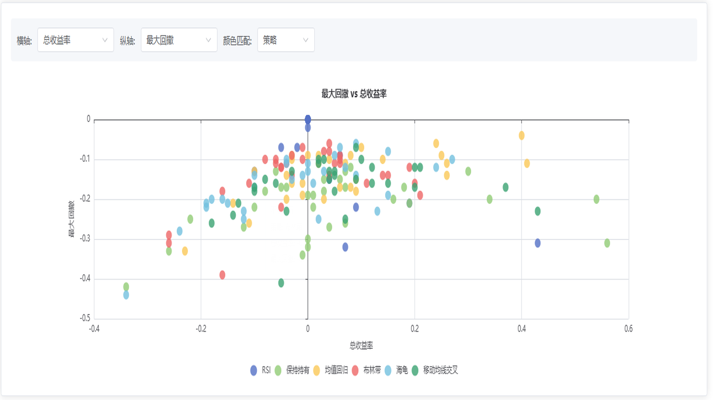
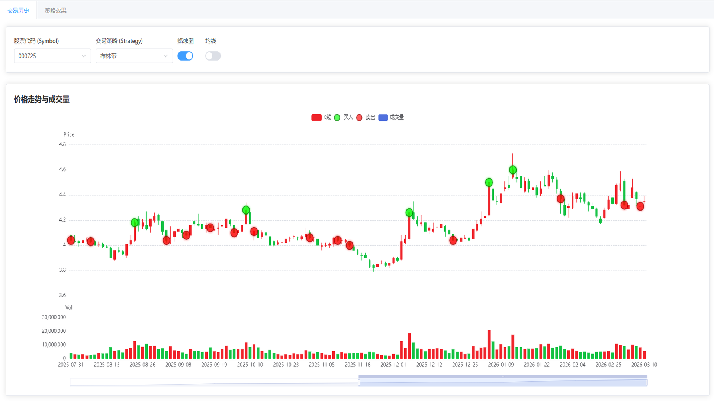

# jiuhuang-pysdk

jiuhuang（韭皇）是一个高性能、简洁易用的金融数据获取和回测框架。

## 亮点

- **丰富的数据源**：兼容 akshare 多种数据类型，支持 A 股、期货、基金、ETF、宏观等数据
- **统一的数据接口**：通过 `DataTypes` 枚举类统一管理数据类型，输出字段名标准化为英文字段名
- **多时间颗粒度支持**：支持日、周、月级别数据，以及分钟级实时数据
- **智能数据搜索**：内置中文语义搜索功能，快速找到所需数据类型
- **多进程并行回测**：内置多进程并行计算，回测速度极快
- **内置多种策略**：提供海龟交易、均线交叉、RSI、布林带、动量等 11+ 种经典策略
- **可视化回测仪表盘**：交互式图表展示回测结果，支持交易历史、策略分布、排名对比等
- **易于扩展**：支持自定义策略，只需继承 `Strategy` 基类并实现 `_execute_one` 方法
- **MCP Server 支持**：可作为 MCP 服务器运行，AI Agent 可通过标准协议调用
- **Claude Code Skill 集成**：提供 Skill 配置，Claude Code 可直接使用 

## 快速开始

### 安装
uv安装(推荐)
```bash
uv add jiuhuang-pysdk
# 或者uv pip install -U jiuhuang-pysdk
```

pip安装
```bash
pip install -U jiuhuang-pysdk
```


### 初始化

```python
from jiuhuang.data import JiuhuangData, DataTypes

# 方式一：使用环境变量（推荐）
# 设置 API_URL 和 API_KEY 环境变量
# 申请地址：https://jiuhuang.xyz
jh = JiuhuangData()

# 方式二：直接传入参数
jh = JiuhuangData(api_url="https://data.jiuhuang.xyz", api_key="你的API KEY")
```

### MCP 服务器

jiuhuang 支持作为 MCP 服务器运行，方便 AI Agent 调用金融数据。

#### 启动方式

**方式一：直接运行**
```bash
python -m jiuhuang.mcp
```

**方式二：使用 uvx 运行**
```bash
uvx python -m jiuhuang.mcp
```

#### 环境变量

| 变量名 | 说明 | 默认值 |
|--------|------|--------|
| `JIUHUANG_API_KEY` | API 密钥（必填） | - |
| `JIUHUANG_API_URL` | API 地址 | `https://data.jiuhuang.xyz` |

#### 可用工具

MCP 服务器提供以下工具：

- `search_data(keyword, top_n)` - 搜索数据类型
- `describe_data(data_type)` - 获取数据类型详细说明（包含参数说明和代码示例）
- `get_data(data_type, params)` - 通用数据获取

#### 使用流程

1. 使用 `search_data` 搜索需要的数据类型
2. 使用 `describe_data` 查看数据详情和需要的参数
3. 使用 `get_data` 获取数据

#### Claude Code 集成

在 Claude Code 中配置 MCP 服务器：

```json
{
  "mcpServers": {
    "jiuhuang": {
      "command": "python",
      "args": ["-m", "jiuhuang.mcp"],
      "env": {
        "JIUHUANG_API_KEY": "your_api_key"
      }
    }
  }
}
```

### Skill

jiuhuang 提供了 Claude Code Skill，可直接在 Claude Code 中使用。配置方式：

1. 将 `jiuhuang-data-skill` 目录复制到 Claude Code 的 skills 目录
2. 或在项目中引用该 Skill

Skill 提供了完整的工作流指引：
- 动态探索数据类型：先搜索后获取
- 常用数据模式：A 股股价、ETF 数据、宏观数据等
- 快速访问核心模块

### 获取股票数据

```python
from jiuhuang.data import JiuhuangData, DataTypes

jh = JiuhuangData()

# 单一股票数据获取（前复权）
stock_price = jh.get_data(
    DataTypes.STOCK_ZH_A_HIST_D_QFQ,  # 前复权
    start="2025-01-01",
    end="2026-02-06",
    symbol="000001",
)

# 多只股票数据获取
symbols = ["000568", "000651", "000725", "000776", "000895"]
stock_price = jh.get_data(
    DataTypes.STOCK_ZH_A_HIST_QFQ,  # 前复权
    start="2025-01-01",
    end="2026-02-06",
    symbol=",".join(symbols),  # 多只股票使用英文逗号分隔
)
```

> **说明**：`jiuhuang` 兼容了 akshare 多种数据类型，`DataTypes`（枚举类）对应了 `ak.xxxx()`。例如：`akshare.stock_zh_a_hist()` 对应 `DataTypes.STOCK_ZH_A_HIST`。不同点在于：akshare 通过 `adjust` 参数控制复权方式，而 jiuhuang 通过 `DataTypes` 有无后缀进行区分（如 `_QFQ` 表示前复权）。另外 jiuhuang 输出的 DataFrame 都是字段命名标准化后的英文字段名。

### 不同时间颗粒度数据

```python
from jiuhuang.data import JiuhuangData, DataTypes
from datetime import datetime, timedelta

jh = JiuhuangData()

# 日数据，使用时间格式 YYYY-MM-DD
stock_price = jh.get_data(
    DataTypes.STOCK_ZH_A_HIST_QFQ,
    start="2025-01-01",
    end="2026-02-06",
    symbol="000568",
)

# 月数据，使用时间格式 YYYY-MM
cpi = jh.get_data(
    DataTypes.MACRO_CHINA_CPI,
    start="2025-01",
    end="2026-02",
)

# 分钟级数据，使用时间格式 YYYY-MM-DD HH:MM:SS
now = datetime.now()
price_realtime = jh.get_data(
    DataTypes.STOCK_ZH_A_SPOT,
    start=now - timedelta(minutes=10).strftime("%Y-%m-%d %H:%M:%S"),
    end=now.strftime("%Y-%m-%d %H:%M:%S"),
    symbol="000001",
)
```

### 搜索和描述数据

```python
from jiuhuang.data import JiuhuangData, DataTypes

jh = JiuhuangData()

# 中文名搜索
results = jh.search_data("A股 股价 前复权", top_n=5)

# 数据详细说明（调用方式、输入输出参数、代码示例）
description_md = jh.describe_data(DataTypes.STOCK_ZH_A_HIST_D_QFQ)
```

### 回测示例

```python
from jiuhuang.data import JiuhuangData, DataTypes
from jiuhuang.strategy import *
from jiuhuang.backtest import backtest
from jiuhuang.dash import display_backtesting
import warnings

warnings.filterwarnings("ignore")

jh = JiuhuangData()

# 定义策略（可使用内置策略或自定义策略）
strategies = {
    "海龟": StrategyTurtle(entry_window=20, exit_window=10),
    "移动均线交叉": StrategyMovingAverageCrossover(12, 24),
    "买入持有": StrategyBuyAndHold(),
}

# 获取数据
symbols = ["000001", "600036", "600519", "000858", "601318", "000002"]
stock_price = jh.get_data(
    DataTypes.STOCK_ZH_A_HIST_QFQ,
    start="2024-12-25",
    end="2026-03-11",
    symbol=",".join(symbols),
)
stock_info = jh.get_data(DataTypes.STOCK_INDIVIDUAL_INFO_EM)

# 执行回测
trading_history, backtest_perf = backtest(
    strategies,
    stock_price,
    stock_info,
)

# 展示回测仪表盘
display_backtesting(trading_history, backtest_perf)
```

### 回测仪表盘预览

| 策略对比 | 策略分布 |
|---------|---------|
|  |  |

| 交易历史 | 策略排名 |
|---------|---------|
|  |  |

### 内置策略

jiuhuang 提供了多种内置策略，可直接使用：

| 策略类 | 说明 |
|-------|------|
| `StrategyTurtle` | 海龟交易策略 - 基于历史高点/低点突破入场 |
| `StrategyMovingAverageCrossover` | 均线交叉策略 - 短期均线与长期均线交叉判断趋势 |
| `StrategyBuyAndHold` | 买入持有策略 - 长期投资基准策略 |
| `StrategyVolumeTrend` | 成交量趋势策略 - 基于成交量和价格趋势 |
| `StrategyVolumeDivergence` | 量价背离策略 - RSI指标和成交量背离 |
| `StrategyMeanReversion` | 均值回归策略 - 价格偏离均值时交易 |
| `StrategyRSI` | RSI 策略 - 基于相对强弱指标 |
| `StrategyBollingerBands` | 布林带策略 - 基于布林带上下轨突破 |
| `StrategyMomentum` | 动量策略 - 基于价格动量 |
| `StrategyBreakout` | 突破策略 - 基于历史高低点突破 |
| `StrategyDualThrust` | Dual Thrust 策略 - 经典日内交易策略 |

### 自定义策略

```python
from jiuhuang.strategy import Strategy
import pandas as pd

class MyStrategy(Strategy):
    def __init__(self, entry_window: int = 20, exit_window: int = 10):
        self.entry_window = entry_window
        self.exit_window = exit_window

    def _execute_one(self, data: pd.DataFrame) -> pd.DataFrame:
        """对单个标的生成买卖信号"""
        data = data.copy()

        # 计算滚动最高价和最低价
        data["entry_high"] = data["high"].rolling(window=self.entry_window, min_periods=1).max()
        data["exit_low"] = data["low"].rolling(window=self.exit_window, min_periods=1).min()

        # 生成买卖信号
        data["buy_signal"] = (data["close"] > data["entry_high"].shift(1)).astype(int)
        data["sell_signal"] = (data["close"] < data["exit_low"].shift(1)).astype(int)

        # 清理临时列
        data = data.drop(["entry_high", "exit_low"], axis=1)
        return data
```

> **注意**：自定义策略需继承 `Strategy` 基类，必须实现 `_execute_one` 方法。入参为 `pandas.DataFrame`，出参需包含 `buy_signal` 和 `sell_signal` 两列。jiuhuang 会默认使用多进程并行进行回测。

## 更多示例

更多示例代码请参考 [examples](./examples/) 目录：

- `0_quickstart.py` - 快速开始：数据获取与回测完整流程
- `1_get_data.py` - 基础数据获取
- `2_get_data_for_diffrent_date_granularity.py` - 不同时间颗粒度数据获取
- `3_search_and_describe_data.py` - 搜索和描述数据接口
- `4_backtest.py` - 自定义策略回测示例
- `5_mcp_server.py` - MCP 服务器调用示例

## License

MIT License

Copyright (c) 2026 jiuhuang

Permission is hereby granted, free of charge, to any person obtaining a copy
of this software and associated documentation files (the "Software"), to deal
in the Software without restriction, including without limitation the rights
to use, copy, modify, merge, publish, distribute, sublicense, and/or sell
copies of the Software, and to permit persons to whom the Software is
furnished to do so, subject to the following conditions:

The above copyright notice and this permission notice shall be included in all
copies or substantial portions of the Software.

THE SOFTWARE IS PROVIDED "AS IS", WITHOUT WARRANTY OF ANY KIND, EXPRESS OR
IMPLIED, INCLUDING BUT NOT LIMITED TO THE WARRANTIES OF MERCHANTABILITY,
FITNESS FOR A PARTICULAR PURPOSE AND NONINFRINGEMENT. IN NO EVENT SHALL THE
AUTHORS OR COPYRIGHT HOLDERS BE LIABLE FOR ANY CLAIM, DAMAGES OR OTHER
LIABILITY, WHETHER IN AN ACTION OF CONTRACT, TORT OR OTHERWISE, ARISING FROM,
OUT OF OR IN CONNECTION WITH THE SOFTWARE OR THE USE OR OTHER DEALINGS IN THE
SOFTWARE.
